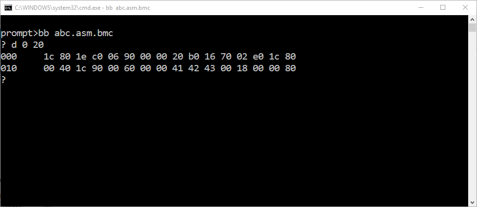

# Big Man Computer

[Check Submission](https://protect.bju.edu/cps/checker/cps230/prog1)

## Overview

Write a program in C to simulate the operations of our hypthetical "Big Boy Computer."

The advanced version will feature an interactive "debugger" that allows direct user control of BBC.

The enhanced version requires exploring features of C and its standard library not covered yet.

## Background

BBC (Big Boy Computer) is a bits-and-bytes oriented spinoff of the venerable [Little Man Computer](https://en.wikipedia.org/wiki/Little_man_computer).  BBC consists of the components listed on your [handout](bbc_handout.pdf); a single "step" of execution consists of:

> Warning: Each index in RAM is a single 8-byte, not a 16-bit short.  When you see `RAM[x]` in the handout, it is referring to the load function discussed in the 85% instructions, not a literal array index.

* "fetching" 2 bytes from `RAM` starting at the address currently held in `PC`
    * so read byte `PC` and byte `PC + 1`
    * then increment `PC` by 2 (to point at the next instruction in `RAM`)
* "decoding" the 16-bits of data fetched as a BBC instruction
    * BBC is *Little Endian*!!
* "executing" the action encoded in the opcode bits (field `X`),
    possibly using the data encoded in the operand bits (field `Y`)

"Running a program" on BBC means

* Loading the machine code (a 16-bit number for each instruction/piece of data) into `RAM` starting at address 0
* Setting `PC` (and `Acc`) to 0
* Repeatedly "stepping" (see above) until we encounter a `hlt` instruction

BBC has very simple input/output (I/O) facilities; it can:

* Print/Read a 16-bit number from/to `Acc` to/from the terminal using hexadecimal notation
* Print/Read a 16-bit number from/to `Acc` to/from the terminal using decimal notation
* Print/Read the bottom 7 bits of `Acc` to/from the terminal as an ASCII character

# Requirements

Implements a C program that simulates the components of BBC and its fetch/decode/execute cycle.

* Simulate `RAM` using a `char` array (4096 elements)
* Simulate `Acc` using a `short` variable
* Simulate `PC` using an `int`, but make sure it is always in the range \[0, 4095\]
* Write a `step` function that performs a single fetch/decode/execute cycle using `RAM`/`PC`/`Acc`
* Use `printf` and `scanf` to implement the I/O features (using the `%x`, `%d`, and `%c` format specifiers)
* Write a `run` function that calls `step` in a loop until a `hlt` is fetched
* Write a `load` function that takes an address and returns a 16-bit Big Endian number
* Write a `store` function that takes an address and a 16-bit Big Endian number and stores it as Little Endian
* Have `main` load a predetermined program (see below) int `RAM` and call `run`

You must load/run the following BBC program (listed below as 16-bit numbers in hex; in Little Endian):

    1c801ec00690000020b0167002e01c8000401c90006000004142430018000080ff00

> Note: The solution should load this program *exactly* as shown, the conversion to / from Big Endian for processing should happen in the load / store methods.

Try to work out on paper what the above program should do before you try running it in your BBC simulator.

Note that `RAM` should be *all zeros* before loading the program into it!

Enhanced BBC simulator to make it an interactive BBC debugger.  Continue to load the program as before,
but do not run it right away.  Instead:

* Prompt the user for a single character of input (`%c` with `scanf`)
* Interpret this single-character command:
    - If `d`, dump a user-specified range of memory:
        + First, read 2 hex integers (`%x` with `scanf`), "start" and "length", without printing any further prompts 
        + Then, print out a "hex dump" of all the bytes from "start" to "start + length"
        + A picture is worth 2048 bytes:

            

    - If `e`, edit a single byte of `RAM` to contain a new value
        + First, read 2 hex integers, "address" and "value", without printing any further prompts
        + Then, set the "address'th" byte of `RAM` to "value"
        + *Make sure* you restrict "address" to the range \[`0x000`, `0xfff`\]
        + *Make sure* you restrict "value" to the range \[`0x00`, `0xff`\]
    - If `a`, print out the current contents of `Acc` and `PC` in hexadecimal (with approprate labels)
    - If `s`, call your `step` function
    - If `r`, call your `run` function
    - If `q`, break out of your loop and terminate the program
    - If `h`, print a short but descriptive help message
* Repeat forever (well, until the user enters `q`)

## Extra Credit Version

Enhance the BBC debugger/simulator to load its program from a
user-specified binary file using the C standard library's `fopen` and `fread` functions.  Take the filename from the command-line arguments passed to the program. If no arguments are specified, print out a brief and helpful "usage guide" message and terminate without doing anything else.

To get started on using command line arguments in C, see the following snippet (notice the change made to the "normal" `main` function):

```
int main(int argc, char *argv[]) {
    // you have <argc> command-line arguments
    // starting at argv[0]
    // ending at argv[argc - 1]
}
```

## Tips

* Use `char` to store/represent a byte, and use `short` to store/represent a 16-bit word
* Any time you are peforming bit manipulation (especially shifts), prefer `unsigned` integer types (e.g., `unsigned short`)
* Use `typedef` to create aliases for your commonly used types; e.g.:
    - `typedef unsigned char byte;` *(make "byte" an alias for "unsigned char")*
    - `typedef unsigned short word;` *(make "word" an alias for "unsigned short")*
    - You can then declare variables of type `byte` or `word` (actually `unsigned char` or `unsigned short`)
* Create `load_word` and `store_word` functions for reading/writing 16-bit values in `RAM`; this puts your
    Endianness logic in *one* place, after which you can forget about the implementation details
* Use global variables to represent the core state of BBC (`RAM`, `Acc`, `PC`); this may feel like poor style,
    but for small programs in a primitive language like C (or assembly), it's not terrible; furthermore, until
    we learn the ins and outs of passing arrays to functions, globals are the simplest/safest way to share an
    array between functions
* Bit manipulation is your friend; e.g., an easy way to force a potentially large integer
    into the range \[`0x000`, `0xfff`\] is an `AND` operation: `value & 0xfff` *(in C notation)*

## Submission

Fill out the [standard program report template](report.md) MD file. Submit the report and your `prog1.c`.

## Validating Submission

[Check Submission](https://protect.bju.edu/cps/checker/cps230/prog1)
